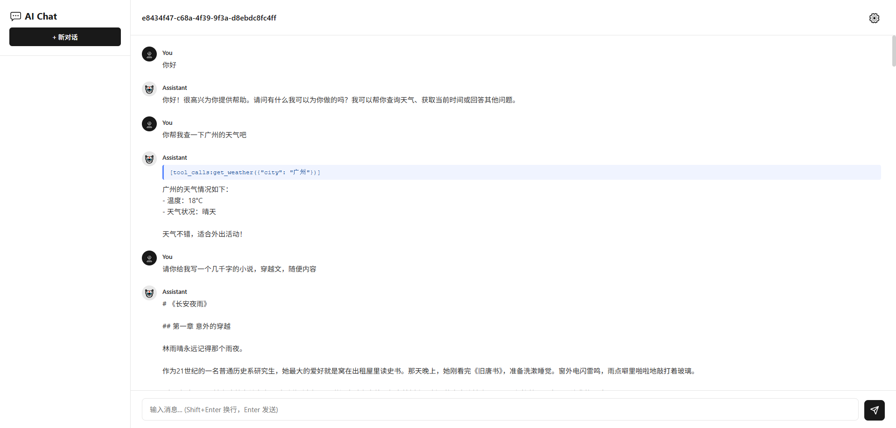

<div align="center">
  

  <h1 align="center">otherone-agent</h1>

  <p align="center">Lightweight AI Agent Infrastructure</p>

  [](https://www.npmjs.com/package/otherone-agent)
  [](https://github.com/yourusername/otherone-agent/blob/main/LICENSE)

  English | [简体中文](./public/README-zh.md)

</div>

> This product is dedicated to my best her! She loves sunflowers 🌻

## 🎯 Vision

otherone-agent is not just another AI framework. It's a **paradigm shift** in how developers build intelligent agents.

We believe AI agent development should be:
- **Simple** - 8 lines to production
- **Powerful** - Enterprise-grade features out of the box
- **Extensible** - Plugin architecture for unlimited possibilities
- **Efficient** - Intelligent context management saves 80% token costs

### The Problem

Current AI frameworks force you to choose between simplicity and power. You either get a toy example that doesn't scale, or a complex enterprise solution that takes weeks to understand.

### The Solution

otherone-agent gives you **both**. Start with 8 lines of code, scale to millions of users.

## 📦 Installation

```bash
npm install otherone-agent
```

## 🚀 Quick Start

> 💡 **AI Quick Development Tip**: You can send this prompt to AI for rapid development:
> 
> "Read this link: https://github.com/wuyoujae/otherone-agent, please help me quickly develop a conversational agent with webui using otherone-agent"

### Basic Usage

```typescript
import { veloca } from 'otherone-agent';

// Create a new conversation
const sessionId = veloca.CreateNewSession();

// First turn
await veloca.InvokeAgent(
    { sessionId, contextLoadType: 'localfile', contextWindow: 128000 },
    {
        provider: 'openai',
        apiKey: process.env.OPENAI_API_KEY,
        baseUrl: 'https://api.openai.com/v1',
        model: 'gpt-4o-mini',
        userPrompt: 'What is 2+2?',
        stream: true
    }
);

// Second turn - automatically loads history
const response = await veloca.InvokeAgent(
    { sessionId, contextLoadType: 'localfile', contextWindow: 128000 },
    {
        provider: 'openai',
        apiKey: process.env.OPENAI_API_KEY,
        baseUrl: 'https://api.openai.com/v1',
        model: 'gpt-4o-mini',
        userPrompt: 'Multiply that by 3',
        stream: true
    }
);

console.log(response.content); // "12"
```

### Usage Example

<div align="center">
  
</div>

### With Tools

```typescript
const tools = [{
    type: 'function',
    function: {
        name: 'get_weather',
        description: 'Get current weather',
        parameters: {
            type: 'object',
            properties: {
                location: { type: 'string' }
            }
        }
    }
}];

const tools_realize = {
    get_weather: async (location: string) => {
        return `Weather in ${location}: Sunny, 72°F`;
    }
};

const response = await veloca.InvokeAgent(
    { sessionId, contextLoadType: 'localfile', contextWindow: 128000 },
    {
        provider: 'openai',
        apiKey: process.env.OPENAI_API_KEY,
        baseUrl: 'https://api.openai.com/v1',
        model: 'gpt-4o-mini',
        userPrompt: 'What is the weather in San Francisco?',
        tools,
        tools_realize,
        stream: true
    }
);
```

That's it. You now have:
- ✅ Multi-turn conversation memory
- ✅ Automatic context management
- ✅ Streaming responses
- ✅ Tool calling support
- ✅ Intelligent context compression
- ✅ Production-ready persistence

## 📚 Advanced Features

### Context Compression

Veloca automatically compresses conversation history when approaching token limits:

```typescript
const response = await veloca.InvokeAgent(
    {
        sessionId,
        contextLoadType: 'localfile',
        contextWindow: 128000,
        thresholdPercentage: 0.8  // Compress at 80% capacity
    },
    {
        provider: 'openai',
        apiKey: process.env.OPENAI_API_KEY,
        baseUrl: 'https://api.openai.com/v1',
        model: 'gpt-4o-mini',
        userPrompt: 'Continue our conversation...',
        // Compression LLM config (optional)
        compact_llm_model: 'gpt-4o-mini',
        compact_llm_temperature: 0.3,
        stream: true
    }
);
```

### Custom Storage

```typescript
// Read session data
const sessionData = veloca.ReadSessionData(sessionId);

// Get all sessions
const allSessions = veloca.GetAllSessions();

// Manual entry writing
veloca.WriteEntry({
    storageType: 'localfile',
    sessionId,
    role: 'user',
    content: 'Custom message'
});
```

## 🔥 Core Features

### 🧠 Smart Context Management
- **Automatic Compression**: Summarizes conversation history when approaching token limits
- **Token Estimation**: Built-in token counting to help you stay within limits
- **Configurable Thresholds**: Set when compression should trigger (default 80%)

### 🔄 Multi-Provider Ready
- **OpenAI**: Full support with streaming
- **Anthropic**: Coming soon
- **Custom APIs**: Extensible architecture for your own LLM

### 🛠️ Simple Tool Calling
- **Easy Definition**: Define your tools, we handle the execution loop
- **Type Safe**: Full TypeScript support for better DX
- **Error Handling**: Built-in retry and error management

### 💾 Zero-Config Storage
- **Local File**: JSON-based storage, no setup required
- **Session Management**: UUID-based conversation tracking
- **History Tracking**: Complete audit trail of interactions

### 🏗️ Why otherone-agent?

**Lightweight**: No heavy dependencies, just the essentials you need.

**Developer-Friendly**: Sensible defaults mean you can start with minimal configuration.

**Modular**: Use only what you need - token estimation, context management, or the full agent loop.

**Transparent**: Simple, readable code. No magic, no surprises.

## ✨ Features

- 🚀 Support for streaming and non-streaming responses
- 🔧 Automatic tool loop processing
- 💾 Flexible context management and compression
- 📦 Modular design, easy to extend
- 🔌 Support for multiple AI providers (OpenAI, Anthropic, Fetch)

## 🎯 Roadmap

### ✅ Completed
- Core agent loop
- OpenAI integration
- Context management
- Tool calling
- Local file storage
- Streaming support

### 🚧 In Progress
- MCP server integration
- Skills system
- Web UI

### 📋 Planned
- More provider support (Anthropic, Claude, etc.)
- Database storage adapter
- Advanced caching strategies
- Plugin marketplace
- ...and more!

## 📄 License

MIT
